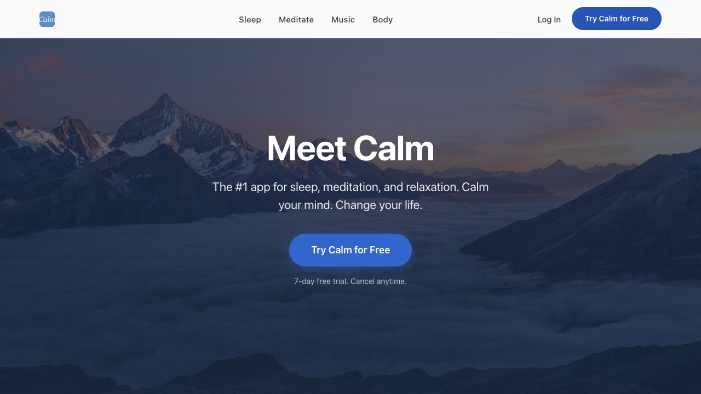
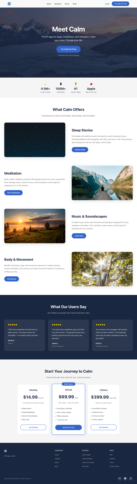

# Calm.com Mock

A pixel-perfect, fully functional mock of [calm.com](https://calm.com) — the #1 app for sleep, meditation, and relaxation.

## Features

- **Header Navigation** — Sticky header with Calm logo, navigation links (Sleep, Meditate, Music, Body), Login/CTA buttons, and responsive hamburger menu
- **Hero Section** — Full-viewport hero with nature background image, gradient overlay, headline, subtitle, and call-to-action
- **Social Proof Bar** — Stats display: 4.5M+ reviews, 100M+ downloads, #1 App for Sleep, Apple App of the Year
- **Feature Sections** — Four alternating-layout sections for Sleep Stories, Meditation, Music & Soundscapes, and Body & Movement with real images
- **Testimonials** — Three user testimonial cards with star ratings, quotes, and user roles on a dark background
- **Pricing Cards** — Three subscription tiers (Monthly $14.99, Annual $69.99, Lifetime $399.99) with highlighted "Most Popular" badge
- **Footer** — Multi-column layout with Company, Offers, Help links, social media icons, and copyright
- **Backend API** — FastAPI REST API serving articles, features, testimonials, and pricing data
- **Responsive Design** — Mobile-first responsive layout with breakpoints at 768px

## Tech Stack

| Layer | Technology |
|-------|-----------|
| Frontend | Vanilla JS + CSS |
| Build Tool | Vite + vite-plugin-singlefile |
| Backend | Python FastAPI |
| Testing (FE) | Vitest (55 tests) |
| Testing (BE) | pytest (10 tests) |
| CI/CD | GitHub Actions |
| Container | Docker (multi-stage) |

## Getting Started

### Prerequisites
- Node.js 20+
- Python 3.12+
- Docker (optional)

### Installation

```bash
# Clone the repository
git clone https://github.com/eigent-swe/calm-mock.git
cd calm-mock

# Frontend
cd frontend
npm install
npm run dev          # → http://localhost:5173

# Backend (in a new terminal)
cd backend
pip install -r requirements.txt
uvicorn app.main:app --port 8000   # → http://localhost:8000
```

### Docker

```bash
docker-compose up --build
# Frontend: http://localhost:5173
# Backend: http://localhost:8000
```

## Screenshots

### Homepage Hero


### Full Page


## API Overview

| Method | Endpoint | Description |
|--------|----------|-------------|
| GET | `/api/health` | Health check |
| GET | `/api/articles` | List all articles |
| GET | `/api/articles?category=Sleep` | Filter articles by category |
| GET | `/api/articles/{slug}` | Get article by slug |
| GET | `/api/features` | List feature sections |
| GET | `/api/testimonials` | List testimonials |
| GET | `/api/pricing` | List pricing plans |

## Testing

```bash
# Frontend tests (55 tests)
cd frontend && npx vitest run

# Backend tests (10 tests)
cd backend && python -m pytest -v
```

## Project Structure

```
calm-mock/
├── .github/workflows/ci.yml     # CI/CD pipeline
├── frontend/
│   ├── index.html                # Entry point
│   ├── src/
│   │   ├── main.js               # App initialization
│   │   ├── style.css             # Base styles
│   │   ├── api.js                # API client
│   │   └── components/
│   │       ├── header.js/css     # Navigation header
│   │       ├── hero.js/css       # Hero section
│   │       ├── social-proof.js/css # Stats bar
│   │       ├── features.js/css   # Feature sections
│   │       ├── testimonials.js/css # User quotes
│   │       ├── pricing.js/css    # Subscription plans
│   │       └── footer.js/css     # Site footer
│   ├── public/assets/            # Images served by Vite
│   ├── Dockerfile
│   └── package.json
├── backend/
│   ├── app/
│   │   ├── main.py               # FastAPI app
│   │   └── data.py               # Mock data
│   ├── tests/
│   ├── Dockerfile
│   └── requirements.txt
├── docker-compose.yml
└── assets/                       # Source images
```
